# 📚 StudyFlow

> **Your all-in-one academic companion.** StudyFlow helps students organize their studying life — manage courses, track progress, beat deadlines, and study smarter with AI-powered tools.

---

## 🌐 Live Demo

> _Coming soon _

---

## 📸 Screenshots

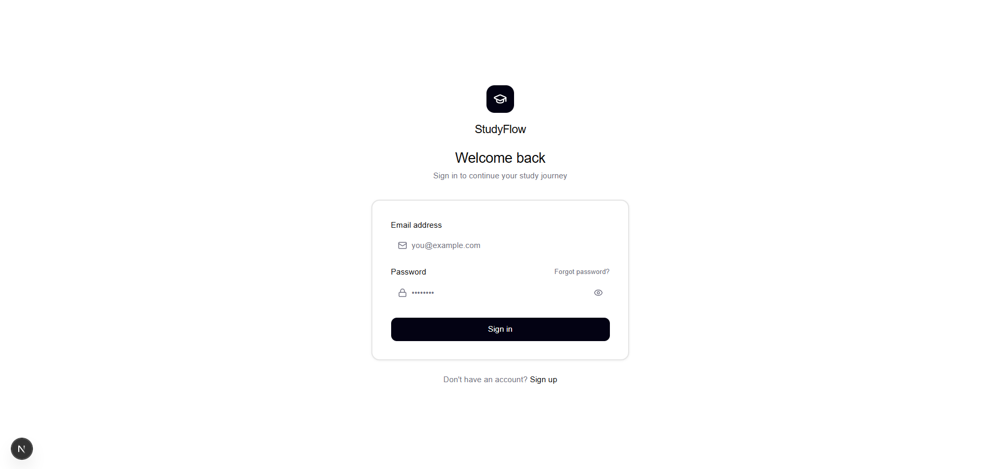
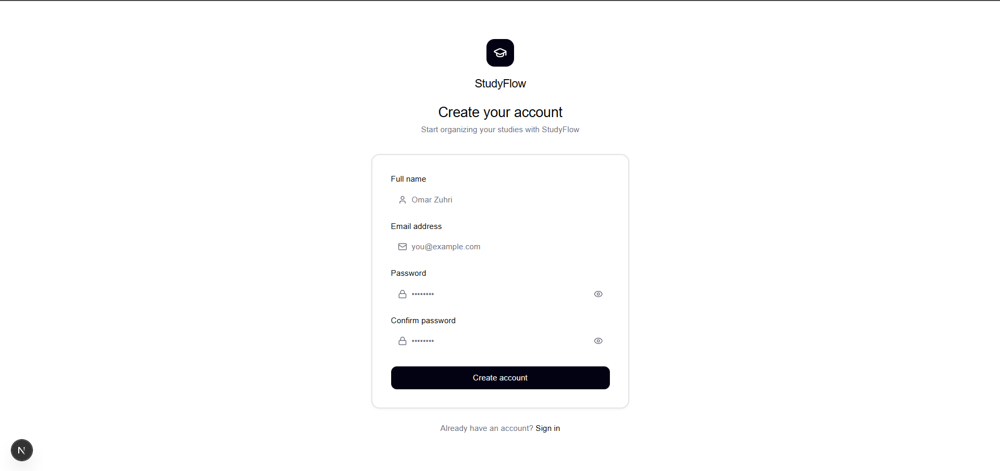
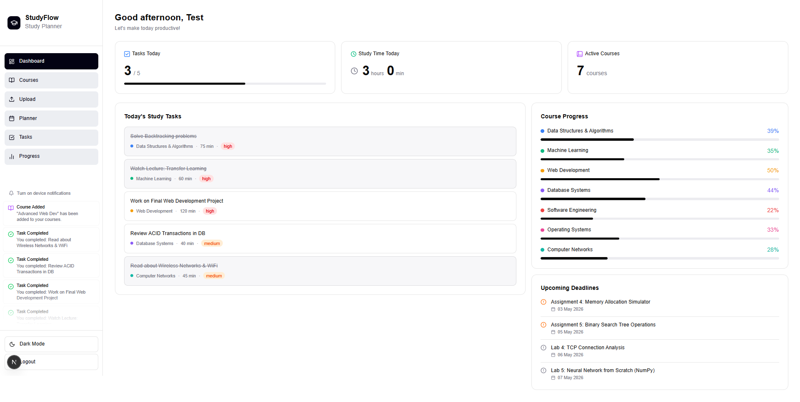
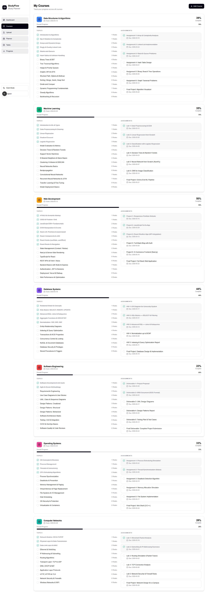
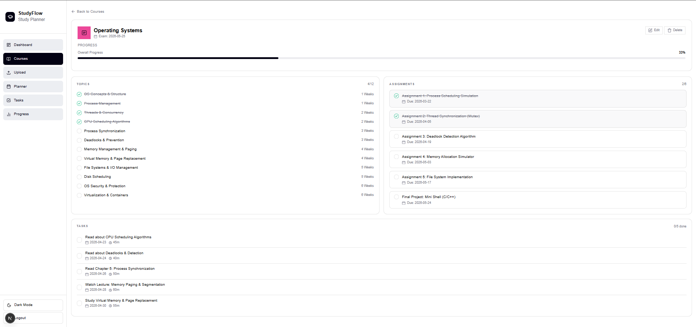
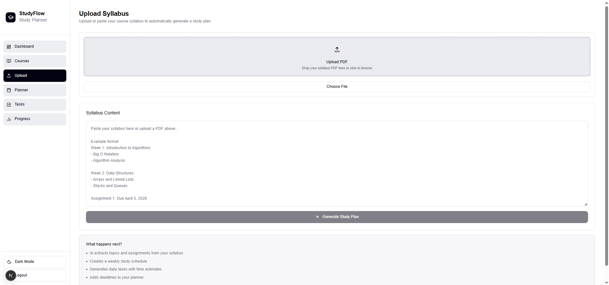
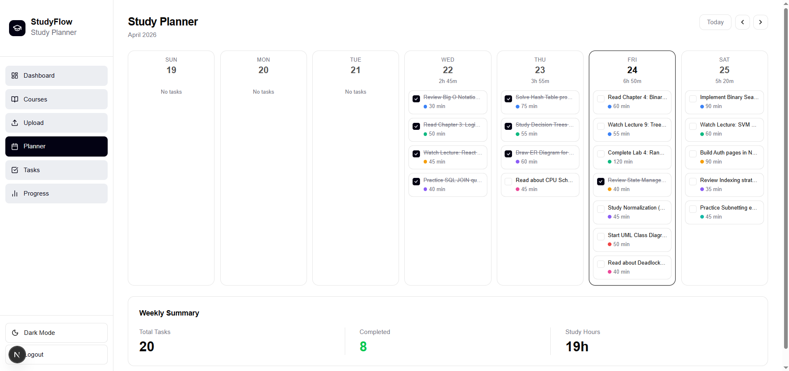
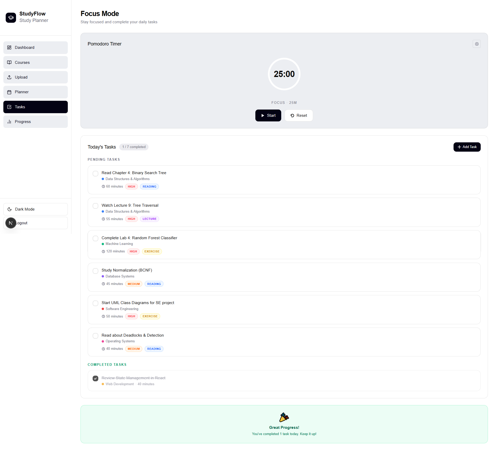
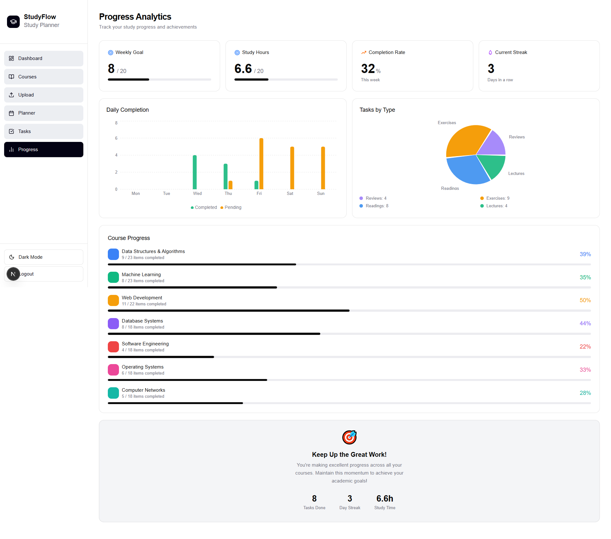
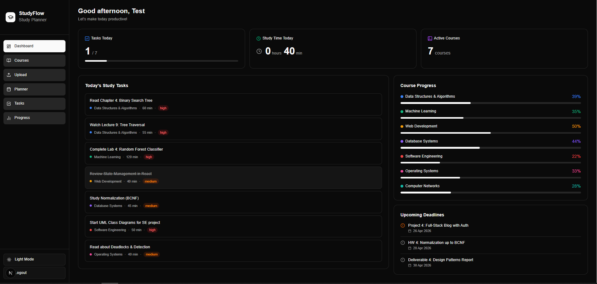
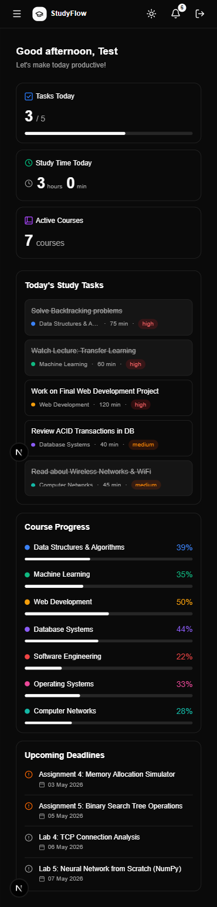

---

## ✨ Features

### 🏠 Dashboard
- At-a-glance overview of today's tasks, course progress, and upcoming deadlines
- Key academic stats and performance indicators

### 📖 Courses
- Course cards displaying exam dates, progress bars, assignments, and topics
- Topic checkboxes to track what you've covered
- Click any course card to open a dedicated page with full details and course-specific tasks

### 🤖 AI Syllabus Upload
- Upload your syllabus PDF and let AI automatically create your course
- Preview and edit the generated course before adding it
- Powered by the Anthropic Claude API

### 📅 Planner
- Interactive calendar showing tasks for each day
- Stats bar for weekly planning overview
- Visual schedule management for the entire semester

### ⏱️ Tasks & Pomodoro Timer
- Built-in Pomodoro timer to structure focused study sessions
- Today's task list with priority and course tags

### 📊 Progress
- Multiple stats and charts tracking your academic performance
- Visual representation of study habits and course completion

### 🔐 Authentication
- Login, Register, and Forgot Password pages
- Secure token-based authentication

### 🎨 UI/UX
- Fully responsive: sidebar navigation on desktop, burger menu on mobile
- Dark mode / Light mode toggle
- Clean and intuitive interface built for students

### 🔔 In-App Notifications
- Real-time notification feed in the sidebar
- Notifications for task events, deadline reminders, and Pomodoro session completions
- Course progress updates trigger automatic notifications

### 📲 Push Notifications
- Browser push notification support via Service Worker
- Notification toggle in the UI to subscribe/unsubscribe
- Deadline and session reminders delivered even when the app is in the background

### ⚡ Server-Side Rendering (SSR) Optimization
- Dashboard and key components refactored to use server-side data fetching
- Proper separation of server and client components using `"use client"` directive
- Loading skeleton components for improved perceived performance
- Reduced client-side JavaScript bundle size

---

## 🛠️ Tech Stack

### Frontend
| Technology | Purpose |
|------------|---------|
| **Next.js 14** (App Router) | React framework with file-based routing |
| **TypeScript** | Type safety across the entire frontend |
| **Tailwind CSS** | Utility-first styling |
| **React Context API** | Global state management (auth, dark mode) |

### Backend
| Technology | Purpose |
|------------|---------|
| **Laravel** | RESTful API backend |
| **mySQL** | Database (development) |
| **Laravel Sanctum** | API authentication |

### AI
| Technology | Purpose |
|------------|---------|
| **Openai API** | Syllabus parsing and course generation |

---

## 📁 Project Structure

```
StudyFlow/
├── backend/                  # Laravel API
│   ├── app/
│   │   ├── Http/
│   │   │   ├── Controllers/  # API controllers
│   │   │   ├── Requests/     # Form validation
│   │   │   └── Resources/    # API response transformers
│   │   ├── Models/           # Eloquent models
│   │   ├── Policies/         # Authorization policies
│   │   └── Services/         # Business logic
│   ├── database/
│   │   ├── migrations/       # Database schema
│   │   ├── factories/        # Model factories
│   │   └── seeders/          # Database seeders
│   └── routes/               # API route definitions
│
└── frontend/                 # Next.js App
    ├── app/
    │   ├── (auth)/           # Auth pages (login, register, forgot-password)
    │   └── (root)/           # Protected pages
    │       ├── dashboard/
    │       ├── courses/
    │       ├── planner/
    │       ├── tasks/
    │       ├── progress/
    │       └── upload/
    ├── components/           # UI components
    │   ├── Auth/
    │   ├── Course/
    │   ├── Dashboard/
    │   ├── Planner/
    │   ├── Progress/
    │   ├── Sidebar/
    │   ├── Tasks/
    │   └── Upload/
    │   └── basicComponents/
    │   └── skeletonComponents/
    │   └── statsComponents/
    ├── hooks/                # Custom React hooks
    │   ├── useCourses.ts
    │   ├── useTasks.ts
    │   ├── useProgress.ts
    │   ├── usePlanner.ts
    │   ├── usePomodoro.ts
    │   ├── useDeadlines.ts
    │   └── useDarkMode.ts
    ├── lib/                  # Utilities and config
    │   ├── api.ts            # Axios API client
    │   ├── auth-context.tsx  # Auth state provider
    │   └── utils/
    │   └── constants/
    ├── types/                # TypeScript type definitions
    │   ├── course.ts
    │   ├── task.ts
    │   ├── assignment.ts
    │   ├── deadline.ts
    │   ├── progress.ts
    │   └── auth.ts
    └── styles/               # Global styles
```

---

## 🚀 Getting Started

### Prerequisites

- **Node.js** v18+
- **PHP** v8.1+
- **Composer**
- **npm** or **yarn**

### 1. Clone the Repository

```bash
git clone https://github.com/your-username/studyflow.git
cd studyflow
```

### 2. Backend Setup (Laravel)

```bash
cd backend

# Install PHP dependencies
composer install

# Copy environment file
cp .env.example .env

# Generate application key
php artisan key:generate

# Run database migrations
php artisan migrate

# (Optional) Seed with sample data
php artisan db:seed

# Start the development server
composer run dev
```

> The backend API will be running at `http://localhost:8000`

### 3. Frontend Setup (Next.js)

```bash
cd frontend

# Install dependencies
npm install

# Copy environment file
cp .env.example .env.local
```

Edit `.env.local` and add your environment variables:

```env
NEXT_PUBLIC_API_URL=http://localhost:8000/api
```

```bash
# Start the development server
npm run dev
```

> The frontend will be running at `http://localhost:3000`

---

## 🔑 Environment Variables

### Backend (`backend/.env`)

```env
APP_NAME=StudyFlow
APP_URL=http://localhost:8000
DB_CONNECTION=mysql
OPENAI_API_KEY=your_open_api_key
```

### Frontend (`frontend/.env.local`)

```env
NEXT_PUBLIC_API_URL=http://localhost:8000/api
```

---

## 📡 API Overview

| Method | Endpoint | Description |
|--------|----------|-------------|
| `POST` | `/api/register` | Register a new user |
| `POST` | `/api/login` | Login and receive token |
| `POST` | `/api/logout` | Logout |
| `GET` | `/api/courses` | Get all user courses |
| `POST` | `/api/courses` | Create a new course |
| `GET` | `/api/courses/{id}` | Get a specific course |
| `PUT` | `/api/courses/{id}` | Update a course |
| `DELETE` | `/api/courses/{id}` | Delete a course |
| `GET` | `/api/tasks` | Get all tasks |
| `POST` | `/api/tasks` | Create a task |
| `PUT` | `/api/tasks/{id}` | Update a task |
| `GET` | `/api/progress` | Get progress stats |
| `POST` | `/api/generate-course` | Upload and parse syllabus via AI |
| `GET`    | `/api/notifications`       | Get all user notifications          |
| `POST`   | `/api/notifications`       | Create a notification               |
| `DELETE` | `/api/notifications/{id}`  | Delete a notification               |
| `POST`   | `/api/push-subscriptions`  | Save a push notification subscription |
| `DELETE` | `/api/push-subscriptions`  | Remove a push subscription          |

---

## 🗺️ Future Possible Roadmap

- [ ] AI Study Assistant (chat interface per course)
- [ ] Smart Flashcard System with spaced repetition
- [ ] Grade & GPA Calculator
- [ ] Study Session Heatmap (GitHub-style)
- [ ] Weekly Study Plan Generator
- [x] Push notifications for deadlines
- [x] In-app notification system with sidebar feed
- [ ] Achievements & Badges system
- [ ] Note-taking per topic
- [ ] Mobile app (React Native)

---

## 🤝 Contributing

Contributions are welcome! Please follow these steps:

1. Fork the repository
2. Create a feature branch: `git checkout -b feature/your-feature-name`
3. Commit your changes: `git commit -m 'Add some feature'`
4. Push to the branch: `git push origin feature/your-feature-name`
5. Open a Pull Request

---

## 👤 Author

**Omar Zuhri**
- GitHub: [@omar-z-z](https://github.com/omar-z-z)
- LinkedIn: [@omar-zuhri](https://linkedin.com/in/omar-zuhri)

---

## 📄 License

This project is licensed under the **MIT License** — see the [LICENSE](LICENSE) file for details.

---

<p align="center">
  Built to make student life a little easier.
</p>